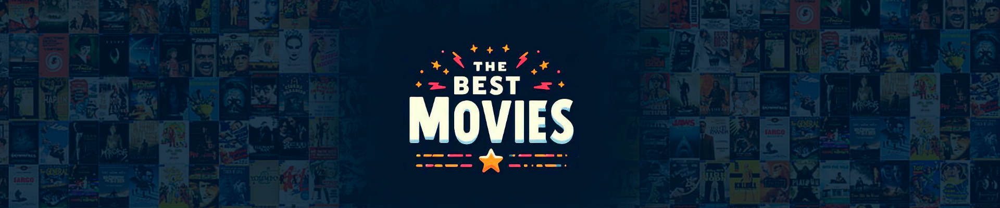

<h1>
    <a href="https://www.laboratoria.la/br">
     </a>
    <span>Projeto 02 - Dataverse</span>
</h1>

## 1. Resumo do projeto
O sistema oferece uma experiência eficiente para entusiastas de filmes explorarem um catálogo, fornecendo informações cruciais, como título, gênero, elenco e sinopse. As usuárias podem filtrar e ordenar os filmes com base em suas preferências pessoais, proporcionando uma navegação intuitiva e personalizada para descobrir novos títulos de entretenimento audiovisual.

## 2. História do usuário
[]()
[]()
[]()
[]()
[]()

## 3. Criação dp (Dataset) através de prompts e IA
### Prompt gerado com ChatGPT
[]()

### Imagem do banner desenvolvida com Bing - IA
[]()

## 4. Funcionalidades


## 5. Prototipo
[]()
[]()
[]()

## 6. Comandos utilizados no Git e Git

```
Comandos para enviar atualizações do projeto:
git add .
git commit -m "frase das alterações"
git push origin nomeBranch

Comando para criar branch:
git checkout -b nome_branch

Comando para atualizar os projetos:
git pull origin/Nome_branch

```

***
[](https://www.laboratoria.la/br)
[](https://github.com)
## Referências
- [Tabela do IMDb](https://www.imdb.com/chart/top/?ref_=nv_mv_250)
- [Figma](https://figma.com)

***
